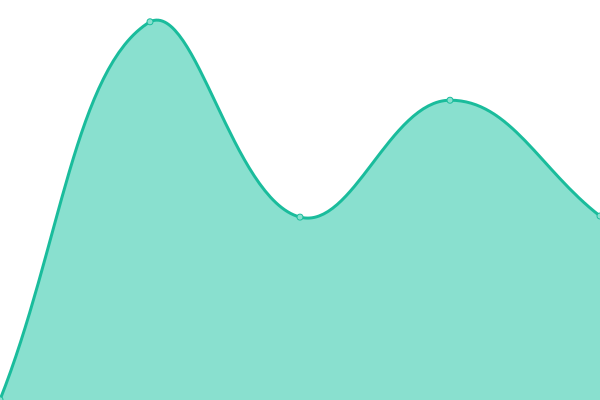

# <!--live status--> **🟩 All systems operational**

<!--start: status pages-->
<!-- This summary is generated by Upptime (https://github.com/upptime/upptime) -->
<!-- Do not edit this manually, your changes will be overwritten -->
<!-- prettier-ignore -->
| URL | Status | History | Response Time | Uptime |
| --- | ------ | ------- | ------------- | ------ |
|  [One Retail](https://oneretailgroup.com.au) | 🟩 Up | [one-retail.yml](https://github.com/Windsorborn/website-uptime/commits/HEAD/history/one-retail.yml) | 

 895ms
     
 | 

<a href="https://Windsorborn.github.io/website-uptime/history/one-retail">100.00%</a>
    

|  [Arc31](https://arc31.com) | 🟩 Up | [arc31.yml](https://github.com/Windsorborn/website-uptime/commits/HEAD/history/arc31.yml) | 

 920ms
     
 | 

<a href="https://Windsorborn.github.io/website-uptime/history/arc31">100.00%</a>
    

<!--end: status pages-->

--
[Status page](https://windsorborn.github.io/website-uptime/)

## 📄 License

- Powered by: [Upptime](https://github.com/upptime/upptime)
- Code: [MIT](./LICENSE) © [Upptime](https://upptime.js.org)
- Data in the `./history` directory: [Open Database License](https://opendatacommons.org/licenses/odbl/1-0/)
